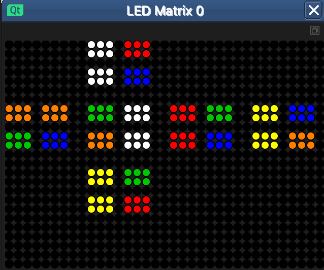
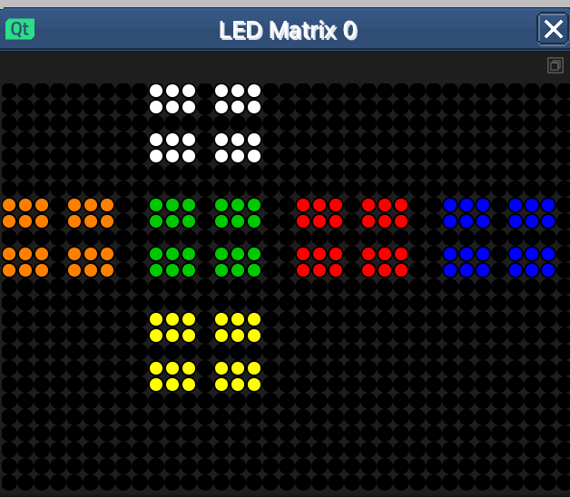
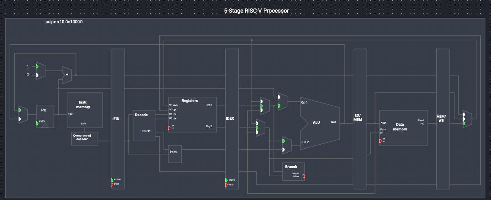
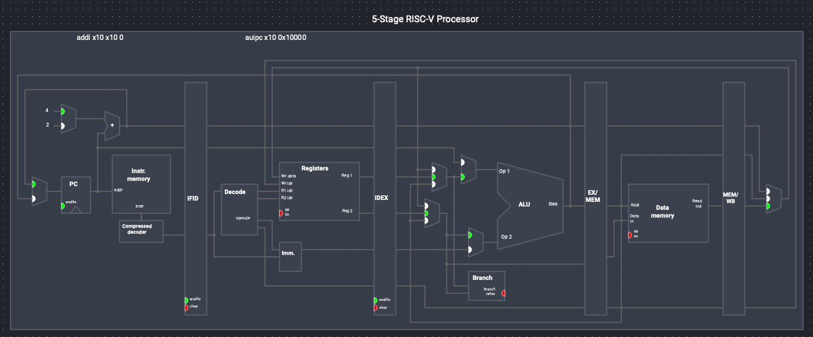
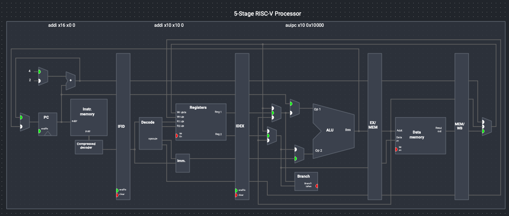
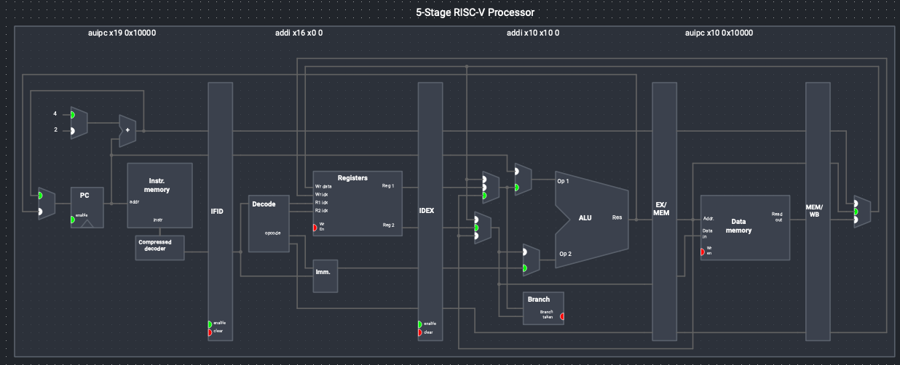
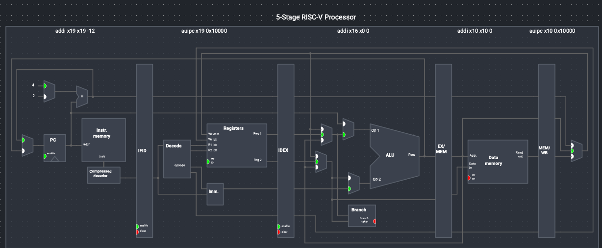

# Assignment 1: minirubik on RV32I

## 0. Setup and Disclosure

| Setup | Detail |
| - | - |
| Fork URL | https://github.com/NutNut17/minirubik (commit `73e4239`) |
| Upstream URL | https://github.com/sysprog21/minirubik (commit `231796c`) | 
| Ripes Build | master `5b8a616` (`v2.2.6-106-g5b8a616`), built from source in Release mode with CMake 4.4.3 and Qt 6.11.2 |
| System GCC Version | Apple clang version 17.0.0 (clang-1700.6.4.2) Target: arm64-apple-darwin25.5.0 |
| `riscv64-elf-gcc` version | GNU GCC 16.2.0 |

> Read `mynote.md` for file understanding

### AI usage disclosure

Claude Code (Anthropic) was used in this assignment due to opposing absurd requiement to implement manually. It explained the concepts in `report.md` and `hw2.md`, set up the fork, built Ripes and installed the tools. It wrote the measurement scripts, but the numbers in this note come from running them on my machine. It wrote and tested the RV32I solver, the table generators and the test scripts, and it produced and measured the optimisation steps. In the process, I tried to find the problem and finding path to optimization. 

### My summary

Throughout the project, I explored how to measure performance of different levels of abstraction. Saw the impact of storing decision, the bit-space optimization (operation, storing and coutning) as well as explored multiple pruning methods with pre-calculated table. It was a steep curve of learning. Although I didn't did everything myself, but I learn a lot through this project.

## 1. The State Space

> Outline: Math of the state space: the group and its order (3,674,160), the Cayley graph, the 9 generators, why BFS proves the diameter is 11, and the mod-3 twist rule.

### Cube model and fixed corner

The 2x2x2 cube has 8 corner cubies and no edges or centers. Turning the whole
cube does not change the puzzle, so I fix one corner (cubie 0, front-upper-left)
and only turn the three faces that do not touch it: R, B and D.

A state is a position-to-cubie map `p[0..6]` (a permutation of the seven free
cubies) and a twist `o[0..6]` in {0, 1, 2} for each position. 0 indicates correct, 1 indicates 120deg and 2 indicates 240 degree.

### Group, order and Cayley graph

The reachable states form a group G, the stabilizer of the fixed corner. Its
order comes from counting:

- the 7 free cubies can be permuted in 7! = 5,040 ways;
- the 7 twists give 3^7 values, but only those whose sum is 0 mod 3 are
  reachable, which leaves 3^6 = 729.

|G| = 7! x 3^6 = 5,040 x 729 = **3,674,160**.

The generators are the nine half-turn-metric moves
`R R2 R' B B2 B' D D2 D'`. The Cayley graph has the 3,674,160 group elements
as vertices and an edge from `g` to `g.s` for each generator `s`. The generator set
is closed under inverses, so the graph is undirected and every vertex has
degree 9. That gives 3,674,160 x 9 = 33,067,440 directed edges, which is the
edge count that the baseline's BFS expands. This is a Cayley graph.

### The orientation-sum invariant (mod 3)

Each quarter turn adds twists that total 0 mod 3:

- R: positions with +1, +2, +1, +2, total 6 = 0 mod 3
- B: the same pattern, total 6 = 0 mod 3
- D: all +0, total 0

The sum of all seven twists therefore never changes, and the solved state has sum 0. This is a modulo-3 invariant, not a parity.

### Ranking: Lehmer code and base-3

A state maps to a unique integer in [0, 3,674,160):

```
rank = p * 729 + o
```

- `p` in [0, 5040) is the Lehmer (factoradic) rank of the permutation: for each
  position, count the later entries that are smaller, and combine the counts
  with `p = p * (7 - i) + c_i`.
- `o` in [0, 729) is the first six twists read as a base-3 number.

The solved state has rank 0. Because a move changes the permutation using only
the permutation and the twists using only the twists, `solver.c` keeps two
small transition tables per face instead of one large one.

> Lehmer is designed to punish the state that has more false of the cubies. The punishment is mangified on each iteration

### Diameter 11 by exhaustive BFS

Breadth-first search from the solved state visits all 3,674,160 states, so the
graph is connected and the search sees every distance. The deepest level is 11
and it contains 2,644 states, so a state at distance 11 exists, and because
the search ran out of unvisited states there is none deeper. The Cayley graph
looks the same from every vertex, so the distance from the identity to the
farthest vertex is the diameter.

Distance distribution from `report.md`

| d | states | d | states |
| ---: | ---: | ---: | ---: |
| 0 | 1 | 6 | 50,136 |
| 1 | 9 | 7 | 227,536 |
| 2 | 54 | 8 | 870,072 |
| 3 | 321 | 9 | 1,887,748 |
| 4 | 1,847 | 10 | 623,800 |
| 5 | 9,992 | 11 | 2,644 |

## 2. Stage 1: Characterizing the Baseline

> Outline: Stage 1, baseline: how solver.c works, its costs, your two Ripes measurements, and why the full table fails on Ripes.
> 
### What solver.c computes

`solver.c` builds a table `toward_solved[rank]` over all 3,674,160 states by BFS backward from the solved state. For each state it stores the move that leads one step closer to solved. A query follows those moves until the rank is 0, which gives an optimal solution of at most 11 moves.

Example: `./solver 21345671111111` prints `B' R' D2 R' B R B' R D2 B R'`.

### Where the cost lies

Peak memory of the baseline computed, and measured on my machine with `/usr/bin/time -l`:

| Program | State | Wall time (s, min) | Peak RSS (B) |
| :--- | :--- | ---: | ---: |
| `solver` | 21345671111111 | 0.06 | 19,824,640 |
| `mini` | 12345671111111 | 0.48 | 56,524,800 |

This agrees with `report.md` (solver 0.065 s / 19.8 MB, mini 0.51 s / 56.5 MB).

### Measurement: Ripes memory usage

Method: `calibration/asm/store_loop.s` writes one non-zero byte to each of N consecutive guest addresses on `RV32_ISS` (4 instructions per byte). Peak host memory is recorded for N = 64 KiB (control) up to 8 MiB, three runs each (maximum kept), and
`slope = (peak(N) − peak(control)) / (N − control)`. Two metrics from `/usr/bin/time -l`: peak RSS and macOS peak memory footprint.

| Guest bytes N | Instructions retired | Peak RSS (B) | Peak footprint (B) | Slope, RSS (B/B) | Slope, footprint (B/B) |
| ---: | ---: | ---: | ---: | ---: | ---: |
| 65,536 (control) | 262,149 | 75,382,784 | 15,845,760 | — | — |
| 1,048,576 | 4,194,309 | 129,613,824 | 72,026,368 | 55.17 | 57.15 |
| 4,194,304 | 16,777,221 | 309,706,752 | 252,234,368 | 56.75 | 57.25 |
| 8,388,608 | 33,554,437 | 549,830,656 | 492,489,920 | 57.00 | 57.27 |

Read control (`load_loop.s`: `lbu` from never-written addresses):

| Guest bytes N | Peak RSS (B) | Peak footprint (B) | Slope, RSS | Slope, footprint |
| ---: | ---: | ---: | ---: | ---: |
| 65,536 (control) | 74,924,032 | 15,599,808 | — | — |
| 1,048,576 | 129,597,440 | 72,010,112 | 55.62 | 57.38 |
| 4,194,304 | 309,755,904 | 252,267,200 | 56.88 | 57.32 |
| 8,388,608 | 504,512,512 | 492,506,240 | 51.61 | 57.30 |

Projection for the baseline's 18,405,414-byte peak (57.27 B/B × 18,405,414):

| Metric | Projected host memory |
| :--- | ---: |
| Footprint slope | 1,054,078,060 B = 1005 MiB = **0.98 GiB** (12 % of this machine's 8 GiB) |
| RSS slope | 1,049,108,598 B = 0.98 GiB |

### Measurement: simulation rate per processor model

Method: `calibration/asm/store_loop.s` run at two sizes per model, `--iret --exectime`, three runs each, minimum time kept. `rate = (iret_big − iret_small) / (ms_big − ms_small) × 1000`.

| Model | Loop N small / big | iret small / big | ms small / big (min of 3) | Rate (instr/s) |
| :--- | :--- | :--- | :--- | ---: |
| RV32_ISS | 1,000,000 / 5,000,000 | 4,000,006 / 20,000,006 | 163 / 789 | **25,559,105** |
| RV32_5S | 5,000 / 25,000 | 20,006 / 100,006 | 70 / 352 | **283,688** |

All repeated runs (ms):

| Model | Size | Run 1 | Run 2 | Run 3 |
| :--- | ---: | ---: | ---: | ---: |
| RV32_ISS | 1,000,000 | 163 | 164 | 163 |
| RV32_ISS | 5,000,000 | 830 | 829 | 789 |
| RV32_5S | 5,000 | 72 | 70 | 75 |
| RV32_5S | 25,000 | 352 | 353 | 352 |

This rate is for a sequential 4-instruction loop, the baseline's loads and stores go through the same hash map (about 1 GiB of host memory by the measurement above, which also slows lookups), and its 3.67 MB table and 17.553 MiB peak exceed the 128 KiB static-data budget regardless of speed.

### Why full table fails on Ripes

| Constraint | My data | Does it kill the baseline? |
| :--- | :--- | :--- |
| 128 KiB static data | The table alone is 3,674,160 B = 3,588 KiB | **Yes**, 28× over. |
| Instruction budget | Worst case about 5×10⁷ (my reconstruction from `hw2.md`) vs about 10⁹ | **Yes**, about 20× over. |

## 3. Stage 2: Representation and Algorithm

> Outline: Stage 2, design: IDA* plus heuristic tables, the admissibility argument, and memory per table.

### Search: IDA*

Iterative-deepening A* Algorithm (Korf 1985) with an explicit stack:

```
for bound = h(start) .. 11:
    depth-first walk; at each child with g = depth + 1:
        prune if g + h(child) > bound
        succeed if child is the solved state
    nothing found: bound = bound + 1
```

The Memory is one 12-byte frame stack, no recursion. A move costs 1 whatever its angle. After a move on face f, all three moves on f are skipped, this prunes together with constructed heuristic tables.

### Heuristic tables

h(p, o) is the maximum of four lower bounds. 

| Table | Remembers | Keys | Packed size |
| :--- | :--- | ---: | ---: |
| `hp` | the positions of all cubies (twists ignored) and the encoding of the index for Table A & B | 5,040 | in the permutation records |
| `ho` | the twists only (positions ignored) and the encoding of the index for Table A & B | 729 | in the twist records |
| A | positions of cubies {0, 3, 6} and the twists at positions {0, 2, 3, 4, 5} | 210 × 243 = 51,030 | 25,515 B |
| B | positions of cubies {0, 1, 2, 3, 5} and the twists at positions {0, 1, 2} | 2,520 × 27 = 68,040 | 34,020 B |

The tables are built on the host. The heiristics table reduce the count of worse-case node.

| Heuristic | Mean h (all states, true mean 8.756) | Worst nodes | Mean nodes at distance 11 |
| :--- | ---: | ---: | ---: |
| `hp`, `ho` | 5.144 | 639,792 | 206,618 |
| **+ tables A and B (119,070 keys, chosen)** | **6.743** | **45,312** | **9,721** |

Negative results: a "last-level shortcut" (test for the solved state without expanding children) would help nothing, since only 0.3 % of the children are generated at the last level; and a single bigger table did not fit the budget at one byte per entry (153,090 B).

### Admissibility argument

A heuristic is admissible if h(s) ≤ d(s), the true distance, for every state s.

- Each table entry is a minimum over a set of states
- The maximum of lower bounds is a lower bound
- The bound never cuts an optimal path

### Memory budget (bytes per table)

Measured on the linked ELF with `riscv64-elf-size -A rv/ida_rv.elf`: `.rodata` 118,736 B + `.bss` 11 B = **118,747 B = 116.0 KiB**, against the 128 KiB (131,072 B) limit. There is no heap.

| Item | Layout | Bytes |
| :--- | :--- | ---: |
| Permutation records | 5,040 × 10 B: `next[3]` (3 × 2 B), `hp` (1), `pkA` (1), `pkB` (2) | 50,400 |
| Twist records | 729 × 12 B: `next[3]` (3 × 2 B), `ho` (1), pad (1), `qkA` (2), `qkB` (2) | 8,748 |
| Table A | 51,030 entries × 4 bits | 25,515 |
| Table B | 68,040 entries × 4 bits | 34,020 |
| Move tables and `.bss` | `move_f2`, `move_turns`, `move_end` (9 B each) and the 11-byte path in `.bss` | 38 |
| **Total (computed)** | | **118,721** |
| Total (linked, `.rodata` + `.bss`) | | 118,747 |

## 4. Stage 3: Efficiency in C

> Outline: 5. Stage 3, C optimization: operation counts before and after, and node counts.

### Removing multiply, divide and modulo

RV32I has no `mul`, `div` or `rem` and use bitwise and table lookup (modulo) operation instead.

### Branches and memory traffic

The table shows each change measured alone, one level on top of the previous. "instr/node" is retired instructions divided by children generated, summed over the 14 hardest distance-11 states; "worst" is the hardest state (p = 2234, o = 426; 45,312 children); "sample" is `21345671111111` including parsing the string.

| Level | Change | instr/node | Worst (retired) | vs previous | Sample | `.text` (B) |
| ---: | :--- | ---: | ---: | ---: | ---: | ---: |
| 0 | every child rebuilt from the parent (R2 = 2 lookups, R' = 3) | 97.2 | 4,415,608 | | 1,106,041 | 1,176 |
| 1 | R2 and R' continue from the previous child of the same face | 88.9 | 4,038,057 | −8.5 % | 1,014,579 | 1,240 |
| 2 | test the cheapest bound first (`hp`, `ho`, then A, then B) | 69.2 | 3,142,280 | −22.2 % | 791,453 | 1,216 |
| 3 | twist keys pre-scaled (no multiply in the index) | 66.4 | 3,008,582 | −4.0 % | 789,778 | 1,156 |
| 4 | one record per state, search carries byte offsets | 64.9 | 2,947,298 | −2.3 % | 712,852 | 1,252 |
| 5 | per-level data in one frame struct walked by a pointer | **55.9** | **2,540,235** | −13.9 % | 628,454 | 1,228 |

Total: 97.2 → 55.9 instructions per node (−42.5 %), worst case 4,415,608 → 2,540,235.

Why each step pays, argued from operation counts:

- **Branches and loads.** Over the 25,703,170 children generated for all 2,644 distance-11 states, 25.4 % are rejected by `hp` or `ho` alone, 45.6 % by table A, 12.3 % by table B and 16.7 % survive. 
- **Spills and Addressing.** Putting a level's `lp, lo, cp, co, next, last, move` in one 12-byte frame and walking a frame pointer turns each of them into a load or store with a constant offset, and `depth++` into one add.

### Operation and node counts

| Distance | States | Mean nodes | Max nodes |
| ---: | ---: | ---: | ---: |
| 0 | 1 | 0 | 0 |
| 1 | 9 | 5.0 | 9 |
| 2 | 54 | 8.5 | 15 |
| 3 | 321 | 12.0 | 21 |
| 4 | 1,847 | 15.5 | 29 |
| 5 | 9,992 | 19.2 | 52 |
| 6 | 50,136 | 24.2 | 100 |
| 7 | 227,536 | 40.9 | 250 |
| 8 | 870,072 | 132.0 | 896 |
| 9 | 1,887,748 | 589.6 | 3,637 |
| 10 | 623,800 | 2,085.1 | 18,189 |
| 11 | 2,644 | 9,721.3 | **45,312** |

#### solver.c vs mini.c vs final

| `solver.c` | `mini.c` | `final` |
| -- | -- | -- |
| Optimized | Brute Force | More optimized | Most Optimized |
| Prebuild a mapping tables to the next rank for step of each stage before BFS (2 ops) | Reranking byte representation to rank on every edge during BFS (21 ops) | Use IDA* search on a heuristics to prune branch |


What the optimisations bought compre to previous method:

| Quantity | Baseline `solver.c` | Final |
| :--- | ---: | ---: |
| States visited per query | 3,674,160 | worst 45,312 nodes |
| Edges / children | 33,067,440 | worst 45,312 |
| Transition updates | 66,134,880 | 2 per child |
| Retired instructions, worst distance-11 state, RV32_ISS | ≈ 9.92 × 10⁸ (estimate: 66,134,880 × 15, not measured) | **2,540,235** (measured; all 2,644 distance-11 states run) |
| Instructions per node | ≈ 15 per update | 53.3 to 60.2 across all distance-11 states |

## 5. Stage 4: RV32I Assembly

> Outline: 6. Stage 4, RV32I: key instruction sequences, a table of --iret and .text size per refinement, and a comparison against gcc -O2.

### Key instruction sequences

The solver is `asm/solver.s`, called by the harness `asm/main.s` with the address of the 14-character string in `a0`; it returns the move count in `a0`.

The state of the current level lives in registers (`s9`/`s10` the two record addresses, `a0`/`a3` the last child, `a4` next face, `a7` last face, `s1` budget)

A frame in memory is written only when the search goes one level down. 

### Comparison with gcc -O2 -march=rv32i

The reference is the C version of the same algorithm, `rv/ida_rv.c` built with `riscv64-elf-gcc -O2 -march=rv32i -mabi=ilp32 -ffreestanding -nostdlib` (the numbers of section 4, level 5).

| | C reference (`gcc -O2`) | Assembly (`solver.s`) | Winner |
| :--- | ---: | ---: | :--- |
| hardest state, retired | 2,540,235 (search only) | **1,203,894** (about 1,199,000 without the harness) | assembly, 2.1× fewer |
| 14 hardest states, retired | 25,109,302 | 12,281,162 | assembly, 2.0× fewer |
| instructions per child | 55.9 | 27.4 | assembly |
| `21345671111111`, retired | 628,454 (parse included) | 326,073 (harness included) | assembly |
| `21345671111111` on RV32_5S, cycles | 710,683 | 412,264 | assembly, 1.7× fewer |
| `.text`, whole program | 1,220 B | 1,640 B (solver 1,056 B + harness 584 B) | **C** |
| static data | 118,747 B | 119,251 B | similar, both under 131,072 B |

## 6. Correctness

> Outline: Correctness gates: H1–H4 results (including H3 wall time) and T5–T7.

### Host gates H1–H4

Evidence (host, against the exact BFS table):

| Gate | Result |
| :--- | :--- |
| H1: h ≤ d for all 3,674,160 states | 0 violations (mean h 6.743, mean d 8.756) |
| H2: tables populated, maximum, solved entry | `hp` 5,040 max 7; `ho` 729 max 6; A 51,030 max 8; B 68,040 max 8; solved entry 0 in every table; no unfilled entries |
| H3: length equals the exact distance for every state | 0 wrong lengths over all 3,674,160 states; every returned path replays to the solved state; 28 s wall clock (20.9 s CPU) |
| H4: packed accessor equals unpacked, even and odd indices | 0 mismatches over 119,070 entries |

### Target gates T5–T7

- **T5, every returned path reaches the solved state.** All 2,644 distance-11 states and 700 random states of every distance exit 0 on RV32_ISS: 0 failures. 
- **T6, `21345671111111` returns an optimal 11-move solution.** Exit code 0 requires exactly 11 moves and a solved replay: 326,073 retired on RV32_ISS. The diameter itself is the host result of gate H3.
- **T7, my three cases plus any grader state, on RV32_ISS and a pipelined model.** The table below runs a solved cube, a short scramble and distance-11 states on RV32_ISS and RV32_5S. 

| State | Expected length | RV32_ISS retired | RV32_5S retired | RV32_5S cycles | exit |
| :--- | ---: | ---: | ---: | ---: | :--- |
| `12345671111111` (solved) | 0 | 580 | 579 | 824 | 0 |
| `35724612221132` (R B D R from solved, reduces to 4 moves) | 4 | 3,950 | 3,949 | 5,131 | 0 |
| `21345671111111` (distance 11) | 11 | 326,073 | 326,072 | 412,264 | 0 |
| `41625372313211` (hardest, 45,312 children) | 11 | 1,203,894 | 1,203,893 | 1,533,681 | 0 |

### Test cases and results

C reference build (`rv/ida_rv.c`, `gcc -O2`, harness-free) on the same states:

| State | Expected length | RV32_ISS retired | RV32_5S retired | RV32_5S cycles |
| :--- | ---: | ---: | ---: | ---: |
| `12345671111111` (solved) | 0 | 89 | 88 | 118 |
| `35724612221132` (R B D R from solved, reduces to 4 moves) | 4 | 1,129 | 1,128 | 1,318 |
| `21345671111111` (distance 11) | 11 | 628,454 | 628,453 | 710,683 |

## 7. LED Matrix Visualization

> Outline: LED matrix: how a facelet maps to a pixel and then to an address.

### Visualization




### Net layout and pixel mapping

The LED Matrix is set to 35 wide and 25 tall. It is row-major, one 32-bit word `0x00RRGGBB` per pixel: pixel (x, y) is at `LED_MATRIX_0_BASE + (y * 35 + x) * 4` (the in-GUI text says column-major; `hw2.md` notes it is wrong).

Each facelet has a 4 × 3 pixel cell; a face is 2 × 2 cells

## 8. Pipeline Walkthrough

> Outline: Pipeline walkthrough: IF, ID, EX, MEM, WB with screenshots.







## References

1. `report.md` in the repository, sections 1 to 7.
2. Ripes, https://github.com/mortbopet/Ripes, commit `5b8a616`.
3. Jaap Scherphuis, Pocket Cube (distance distribution in both metrics).
4. Korf, *Finding Optimal Solutions to Rubik's Cube Using Pattern Databases*, AAAI-97.
5. Korf, *Depth-First Iterative-Deepening: An Optimal Admissible Tree Search*, Artificial Intelligence 27(1), 1985, 97-109.
